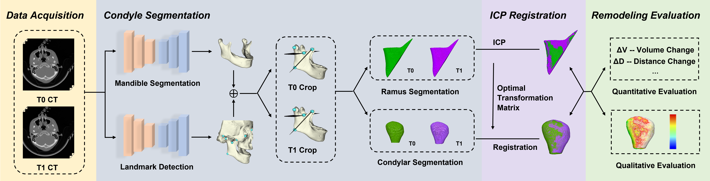

## Welcome to the **FACE**: **F**ully-**A**utomated **C**ondylar Remodeling **E**valuation ! ;-)

by [Wei Jia](https://github.com/WeiJiaFiona)\,[Han Wu](https://hanwu.website/)\,  Lanzhuju Mei, Jiamin Woo, Minjiao Wang<sup>+</sup> and [Zhiming Cui](https://shanghaitech-impact.github.io/)<sup>+</sup>

[[Project Page](https://github.com/WeiJiaFiona/JoD_Fully_Automated_Condylar_Remodeling_Evaluation.git)]
[[Paper](https://www.sciencedirect.com/science/article/abs/pii/S0300571225002635)]


#### 1. What is condylar remodeling ?
* Forces applied during and after orthognathic surgery can induce changes in the condyle's morphology, position, and function, i.e. condylar remodeling.
* Several systematic reviews have emphasized that condylar change should be considered a critical indicator for surgery prognosis. 
* This evaluation is critical for understanding the impact of orthognathic surgery on the TMJ, thereby guiding follow-up care.

#### 2. How to perform condylar remodeling evaluation?
* **Maunal mathod**
  * acquire images during pre- and post-operative phases
  * segmenting and registering condyles manually
    * observer-variant interpretation for condyle
    * experience-demanding
    * time-consuming
  * rough intuitive evaluation   

* **Our proposed automated method**   




  * acquire images during pre- and post-operative phases
  * segmenting and registering condyles from images using V-Net and landmarks.
  * overall evaluations
    * qualitative assessment
      * heapmap : [blue, red] → [resorption, hyperplasia]
      * registration mesh : [blue, yellow] → [T0, T1]
    * quantitative assessment
      * Δ D : local pair points distance change with T0 as reference
      * Δ V : volume change with T0 as reference   


#### 3. To implement evaluation method 


* **Getting Started**
Run the following command to install the required packages:

```
git clone https://github.com/WeiJiaFiona/JoD_Fully_Automated_Condylar_Remodeling_Evaluation.git
conda env create -f FACE_environment.yaml
cd code
```

* **Data Preparation**
  * Put your dataset into the folder 'data'. 
  * The data structure should be formulated into
    ```
    code/data/
    ├── 1
    │   ├── T1_img.nii.gz
    │   ├── T2_img.nii.gz
    ├── 2
    │   ├── T1_img.nii.gz
    │   ├── T2_img.nii.gz
    ├── ...
    └── evaluation
        ├── heapmap
        ├── distance_changes.json
        └──volume_changes.json
   ```
* **Condylar remodeling evaluation**
  * Landmark inference

    ```
    python two_stage_keypoint_detection.py
    ```
  * Mandible segmentation 
    ```
    python two_stage_bone_segmentation.py
    ```
  * Condylar and ramus segmentation 
    ```
    python crop.py
    ```

  * apply ICP registration to transfer mesh into the same perspective
    ```
    python ICP regist.py
    ```
  * Remodeling evaluation
    ```
    python evaluation\heapmap_and_distance_change.py
    python evaluation\volume_change.py
    ```

* **Evaluation process and results**
  * the data generated during evaluation is saved to ```code\data\{ID}```
  * the evaluation results are stored in file ```code\data\evaluation```

#### 3. Some results on test set


